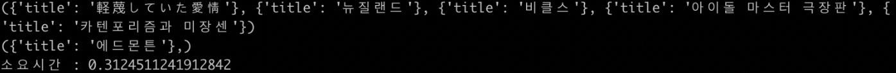
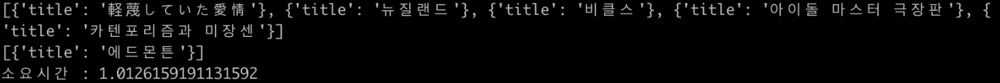

# Compare RDBMS vs NoSQL
<br><br>

<div align=center>
    <strong># Python</strong> &nbsp;
    <strong># MySQL</strong> &nbsp;    
    <strong># MongoDB</strong> &nbsp;
    <br><br>
    <p></p>
</div>
<br>

## What is this?
> "SOOJLE" 프로젝트 진행에 앞서, DB 선택의 의사 결정을 위한 사전 테스트입니다.

RDBMS와 NoSQL의 차이는 대표적으로 "관계성"을 가지고 있냐/아니냐 의 특징이 가장 큰 차이입니다.<br>
프로젝트 진행에 앞서, 이 둘의 차이를 직접 눈으로 보고 확인을 하고 싶어서 진행한 테스트입니다.<br>
"SOOJLE" 서비스는 대체적으로 Create & Update 보다는 Read가 빈번했기 때문에, Read 성능을 위주로 테스트를 진행했습니다.

단, Python DB 라이브러리의 성능 차이도 존재하기 때문에 정확 테스트 결과라고는 말하기 어렵지만, 실제로 프로젝트에 적용할 라이브러리이기 때문에 해당 결과를 어느정도 수용 할 목적으로 진행했습니다.

**테스트 환경은 다음과 같습니다.**
- DataSet : 나무위키 데이터 250,000 Posts
- Library : MySQL(mysqlclient), MongoDB(pymongo)
- PC : 2017 MacBook 13인치 기본형

**테스트 순서는 다음과 같습니다. (인덱스 적용/미적용 차이도 확인)**
- Int Type Compare (TEST 1)
- String Type Compare (TEST 2)
  - Equal (동치 연산)
  - Regex (부분 연산)
- Array Type Compare (TEST 3)

<br>

### Int Type Compare (TEST 1)
```python
# MySQL INT Type TEST
start = time.time()
with MySQL_db.cursor() as cursor:
    sql = "SELECT title FROM post WHERE rand_num=%s;"
    for num in random:
        cursor.execute(sql, (num,))
        result = cursor.fetchall()
        print(result)
print("소요시간 : ", time.time() - start)

# MongoDB INT Type TEST
start = time.time()
for num in random:
    result = list(mongoDB_col.find({'rand_num': num}, {'_id': 0, 'title': 1}))
    print(result)
print("소요시간 : ", time.time() - start)
```

**인덱스 미적용 결과**
<p></p>
<p></p>

**인덱스 적용 결과**
<p></p>
<p></p>

Int 타입의 테스트 결과는 MySQL이 더 빨랐습니다.

### String Type Compare (TEST 2) - Equal (동치 연산)
```python
# MySQL String(Equal) Type TEST
start = time.time()
with MySQL_db.cursor() as cursor:
  sql = "SELECT title FROM post WHERE _text=%s;"
  print("MySQL string(Equal) TEST")
  cursor.execute(sql, (topic_str,))
  result = cursor.fetchall()
print("소요시간 : ", time.time() - start)

# MongoDB String(Equal) Type TEST
start = time.time()
print("MongoDB string(Equal) TEST")
result = list(mongoDB_col.find({'_text': topic_str}, {'_id': 0, 'title': 1}))
print("소요시간 : ", time.time() - start)
```

**인덱스 미적용 결과**
<p></p>
<p></p>

**인덱스 적용 결과**
<p></p>
<p></p>

조금 예상 밖의 결과가 나왔습니다.<br>
인덱스 적용 테스트에서 MongoDB가 성능차이가 크게 나타나지 않았습니다.<br>
(개인적으로, 이 결과는 조금 모순적이라고 생각합니다. Explain 결과를 확인해보아도 인덱스는 잘 적용되었습니다..)

결과적으로 인덱스를 적용하면, 여전히 MySQL이 더 빨랐습니다.

### String Type Compare (TEST 2) - Regex (부분 연산)
```python
# MySQL String(Regex) Type TEST
start = time.time()
with MySQL_db.cursor() as cursor:
    sql = "SELECT COUNT(*) AS cnt FROM post WHERE _text LIKE %s;"
    print("MySQL string(Regex) TEST")
    for topic_one in topic:
        temp_topic = '%' + topic_one + '%'
        cursor.execute(sql, (temp_topic,))
        result = cursor.fetchone()
        print(topic_one, '의 개수: ', result['cnt'])
print("소요시간 : ", time.time() - start)

# MongoDB String(Regex) Type TEST
start = time.time()
for topic_one in topic:
    result = mongoDB_col.find({'text': {'$regex': topic_one}}).count()
    print(topic_one, '의 개수: ', result)
print("소요시간 : ", time.time() - start)
```

**인덱스 미적용 결과**
<p></p>
<p></p>

**인덱스 적용 결과**
<p></p>
<p></p>

결과는 No Indexing / Indexing 둘 다 MongoDB가 더 빠르다는 것을 확인할 수 있습니다.

### Array Type Compare (TEST 3)
```python
# MySQL Array(join) Type TEST
start = time.time()
with MySQL_db.cursor() as cursor:
    sql = "SELECT A.pt_id from (SELECT * FROM post WHERE _text LIKE %s) A JOIN (SELECT pt_id FROM post_contributors WHERE content=%s OR context=%s) B ON A.pt_id = B.pt_id;"
    print("MySQL Array(join) TEST")
    for topic_one in topic:
        temp_topic = '%' + topic_one + '%'
        for contributors in contributors_list:
            cursor.execute(sql, (temp_topic, contributors[0], contributors[1],))
            result = cursor.fetchone()
print("소요시간 : ", time.time() - start)

# MongoDB Array Type TEST
start = time.time()
for topic_one in topic:
    for contributors in contributors_list:
        result = mongoDB_col.find({'$and': [{'text': {'$regex': topic_one}},
                                  {'$or': [{'contributors': contributors[0], {'contributors': contributors[1]}}]}
                                  ).count()
print("소요시간 : ", time.time() - start)
```

<p></p>
<p></p>

결과는 확실히 Join의 성능 저하로 인해서 MongoDB의 속도가 더 빨랐습니다.<br>
(아무래도 리스트 자료형이 없는 RDBMS에게는 불리한 싸움인 것 같습니다.)

<br>

## Dependency
```shell
python 3.6.X
MySQL 5.7.X
MongoDB 4.0.X
```
<br>

## How to use
```shell
python test.py
```
<br>

## About Me
🙋🏻‍♂️ Name: 837477

📧 E-mail: 8374770@gmail.com

🐱 Github: https://github.com/837477

<br>

## Contributing
1. Fork this repository
2. Create your feature branch (`git checkout -b feature/fooBar`)
3. Commit your changes (`git commit -m 'Add some fooBar'`)
4. Push to the branch (`git push origin feature/fooBar`)
5. Create a new Pull Request
